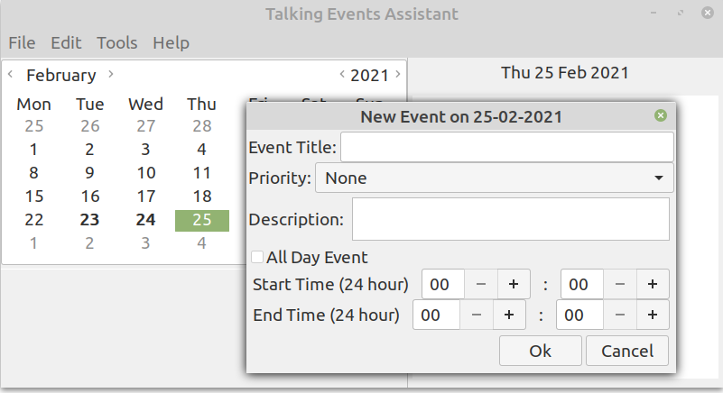
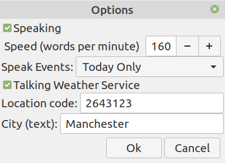
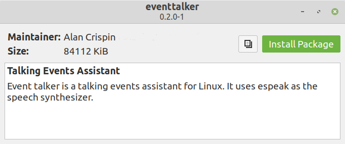

#   Event Talker - Talking Events Assistant


## Overview

Event Talker is a lightweight, easy to use talking events assistant for Linux. It is a Gtk application which uses espeak as the speech synthesizer.




Event Talker is free and open source and built with [Gtk](https://www.gtk.org/) 

## Useage

Double click on a calendar date to enter an event (e.g. meetings, birthdays etc). Add Event Talker to your start up applications and it will read aloud your events for the day when your computer is started. You can read out upcoming events.


### Adding New Event

* Double click on a date in the calendar to invoke the "New Event" dialog.
* Enter the event title, category, description notes, start and end times etc.
* Events are sorted by start time when displayed in the side day page view.
* A visual marker is placed on a day in the calendar which has an event.
* Navigate through the year using the calendar to add events.

     
### Editing Existing Event

* Double click the event in the title list below the calendar to edit.
* Change details as appropriate.

### Preferences

* The options dialog can be accessed from the Edit menu. It enables you to control speech behaviour (switched on by default).

### Experimental Talking Weather Service

* Event Talker version 0.3.0 alpha (testing) incorporates a basic talking weather service
* Event Talker works with weather data from the BBC 
* Using the options dialog to enter a location code for your area
* Then use the Tools->Weather_Today menu item to use the talking weather service




To find a weather location code visit the [BBC Weather site](https://www.bbc.co.uk/weather) and search for your location. The location code  is the numeric part at the end of URL. For example, a search for Manchester UK results in: 

https://www.bbc.co.uk/weather/2643123

The location code is 2643123.

Some examples of weather codes are shown below.

```
2643743 London Greater London
6296599 London City Airport
2644688 Leeds
6296608 Leeds Bradford Airport
2643123 Manchester
6296575 Manchester Airport
2641673 Newcastle upon Tyne
6296611 Newcastle International Airport
2639323 Ripon North Yorkshire
2988507 Paris France
2950159 Berlin Germany
5128581 New York USA
4140963 Washington DC USA
```
For best results, use weather data from nearby airports when you can.

## Installing - First Verify Deb Package

You can verify the deb package before installing by checking the md5sum of the deb package with the appropriate md5 file provided. It can be checked by running the commands:

```
cat eventtalker_0.2.0_amd64.md5
md5sum eventtalker_0.2.0_amd64.deb
```
Both sums (numbers) should be the same. 


## Install Using GDebi (Linux Mint, Ubuntu)

You can install Event Talker by using deb package located in the deb-package directory of this repository.

Right click on the deb package and select "Save Link As" to download.

You can right click on the deb package file and select "Open with GDebi Package Installer". Then click the "Install Package" button.




The GDebi install process has been tested using Linux Mint Debian Edition 4 "Debbie", Linux Mint 20.1 Cinnamon “Ulyssa” and Ubuntu 20.04.2 LTS "Focal".


### Install Using Terminal (Debian)

On Debian you need to use the "su" command. Download the _eventtalker_0.2.0_amd64.deb_ package into the Downloads directory. Open a terminal and install using the commands below:

```
cd Downloads
su 
Password: 
dpkg -i eventtalker_0.2.0_amd64.deb
```
If you get an error such as "root's PATH should usually contain /usr/local/sbin, /usr/sbin and /sbin" then you need to ensure that the environment variables are set up correctly. This issue is usually fixed by the running the commands. 

su nano /root/.bashrc

Go to the very last line and enter:

export PATH=/sbin:/bin:/usr/bin:/usr/sbin:/usr/local/sbin:/usr/local/bin

Save. After updating the bashrc do:

. /root/.bashrc

Now install Event Talker using dpkg. For further details of Debian environment settings see this [post](https://stackoverflow.com/questions/48288790/nb-roots-path-should-usually-contain-usr-local-sbin-usr-sbin-and-sbin-ubun/54502610).

If Event Talker fails to install due to missing dependencies then run

```
sudo apt install -f
```
Then use dpkg again to reinstall the Event Talker deb package. 

The _sudo apt install -f_  attempts to fix (-f) the problem by installing the missing dependencies. The dpkg will install Event Talker once all the dependencies are present. 

The dpkg install method has been tested using Debian 10  with the bashrc script updated using the instructions above. 


## Installing Dependencies Manually

Rather than use GDebi or building from source you can install the dependencies manually using

```
sudo apt install build-essential
sudo apt install libgtk-3-dev
sudo apt install libsqlite3-dev
sudo apt install alsa-utils
sudo apt install espeak
```

### Manual

When Event Talker has been installed you can use the terminal commands

```
whatis eventtalker
man eventtalker
```
for more information about Event Talker

### Remove Event Talker

Event Talkded can be removed by either using the uninstall option of the GDebi Package Installer or run:

```
sudo dpkg -r  eventtalker
or
sudo apt remove eventtalker
```

## Build From Source

The Event Talker source code is provided in the src directory.

Geany can be used as an IDE. There are now meson build files rather than cmake which was used with previous versions. 

## Versioning

[SemVer](http://semver.org/) is used for versioning. The version number has the form 0.0.0 representing major, minor and bug fix changes. Currently at 0.2.0 (stable) and 0.3.0 (testing).

## Authors

* **Alan Crispin** [Gitlab](https://gitlab.com/crispinalan/eventtalker)


## License

This project is licensed under the 2-Clause BSD License.

[2-Clause BSD License](https://opensource.org/licenses/bsd-license.php)

## Roadmap

A number of new features are under development.

## Project History

C++ and Qt were used to develop the original Tiki (talking) diary project but when the Qt Company announced that Qt LTS versions and the offline installer were to become commercial-only [Qt licensing changes](https://www.qt.io/blog/qt-offering-changes-2020) the code was modified to compile using [CopperSpice](https://www.copperspice.com/). Although CopperSpice is a viable alternative to Qt for many projects it is not available in mainstream Linux distribution package management systems. Strangely, there does not seem to be a great deal of concern in the Linux community regarding the Qt licensing changes as discussed in the [Distrowatch article](https://distrowatch.com/weekly.php?issue=20210201#qa) and some distros even have the Qt 5.15 LTS version is their repositories even though updates are suppose to be closed source. However, I decided to completely re-write a talking events application using C and the fully open source Gtk3.0 library and call it Event Talker to avoid any confusion with the previous project.  

One of the main advantages of moving the project to use the Gtk toolkit is that it is widely available in Linux package management systems (and used by many desktops). It is extremely unlikely that the open source license will be changed to being closed source as with Qt LTS. 

As Gtk is widely available in Linux package systems it possible to create a deb package to install (and uninstall) the talking events assistant. Users of Debian based distros (Ubuntu, Linux Mint etc.) wanting to try out Event Talker just need to use the deb package to install Event Talker to test it rather than compile from source code. 

However, moving the project from Qt to Gtk has meant that I have had to remove some of the original features. The Gtk version uses the espeak speech synthesizer rather than the built-in word concatenation TTS code used previously. The talking weather service is not available in the current Gtk version but new features will be added as I learn more about Gtk.

The [Gnome developer centre](https://developer.gnome.org/gnome-devel-demos/stable/c.html.en) tutorials were of great help with learning Gtk.

## Releases


* Version 0.1
    * First Gtk version built with Gtk3.0
    * Sqlite used to store events locally
    * espeak speech synthesiser used for text-to-speech
    * Reads upcoming events at start up
    * Options to change speech pereferences
* Version 0.1.2
    * Bug fixes
* Version 0.2.0
    * export events as csv file
    * import events from csv file
    * checks title field for no entry
    * title character length limted to 30
    * checks description character length to prevent buffer overflow
    * checks that event end time is after start time
    * updated deb package for installation

* Version 0.3.0 alpha (testing only)
    * experimental talking weather service
  

## Acknowledgements

* [Gtk](https://www.gtk.org/)
* GTK is a free and open-source cross-platform widget toolkit for creating graphical user interfaces (GUIs). It is licensed under the terms of the GNU Lesser General Public License.

* [espeak](http://espeak.sourceforge.net/)
* eSpeak is a compact open source software speech synthesizer for English and other languages. The eSpeak text-to-speech project is licensed under version 3 of the GNU General Public License.

* [Sqlite](https://www.sqlite.org/index.html)
* SQlite is an in-process library that implements a self-contained, serverless, zero-configuration, transactional SQL database engine.

* [Geany](https://www.geany.org/)
* Geany is a small and lightweight Integrated Development Environment which only requires the GTK+ runtime libraries. With most Linux distrbutions Geany can be installed via the package manager. Alternatively it can be installed from source using the autotools based build system [Geany autotools build](https://www.geany.org/manual/current/#source-compilation). 
* It has features including syntax highlighting, code completion, auto completion of often used constructs (e.g. if, for and while), code folding, embedded terminal emulation and extensibility through plugins. The Geany IDE uses "tags" files for its autocompletion [tags](https://wiki.geany.org/tags/start). With Linux, these tag files (e.g. the gtk tag file) are copied to the config directory (./config/geany/tags/) to enable code completion.


 


